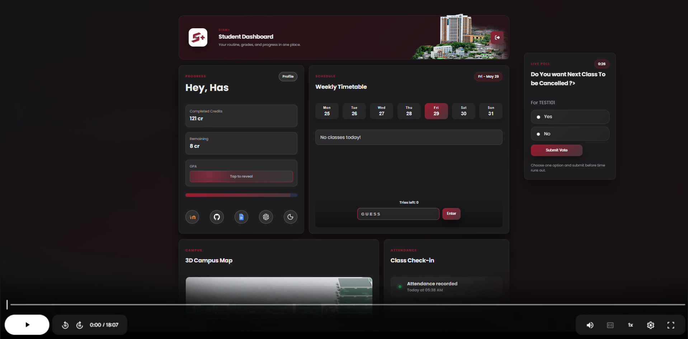
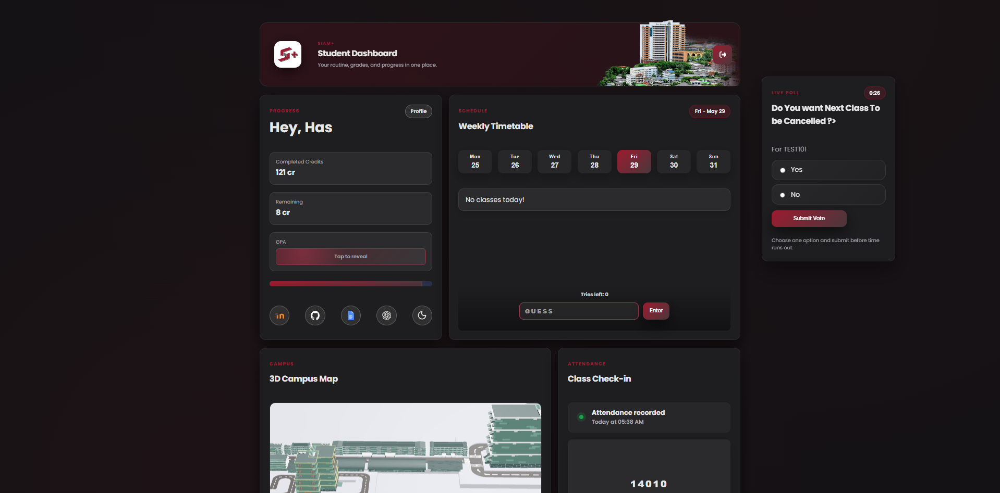
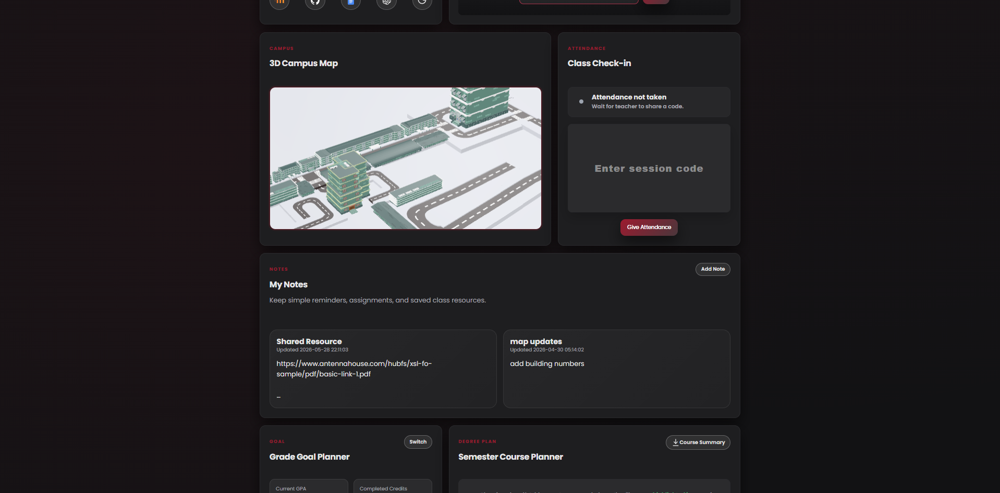
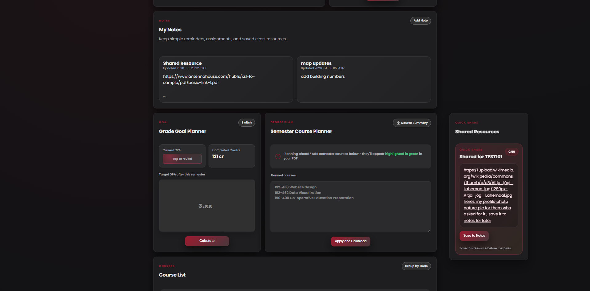
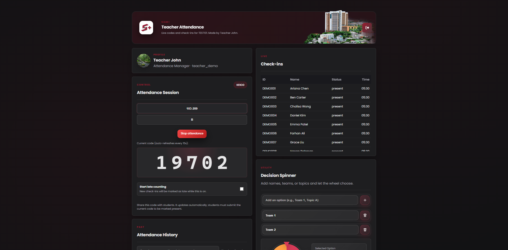
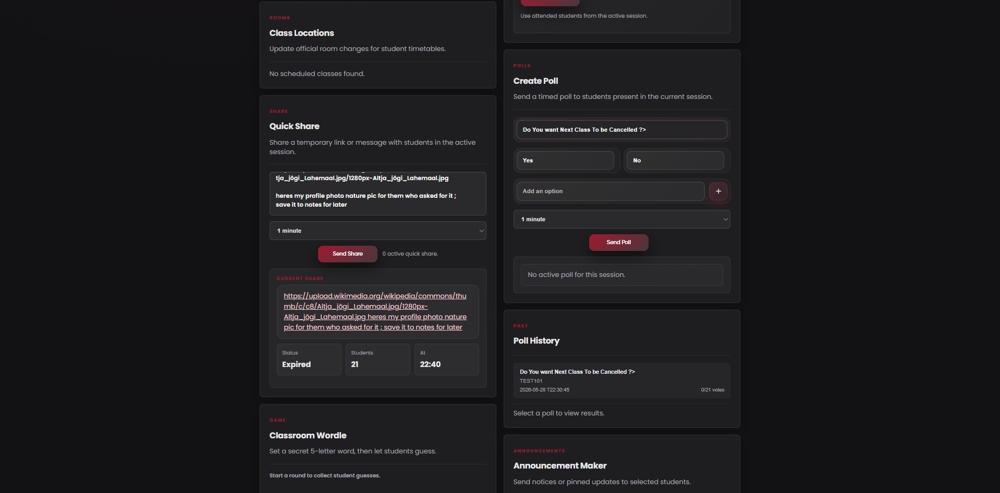
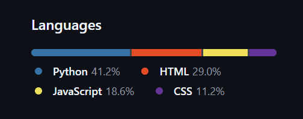
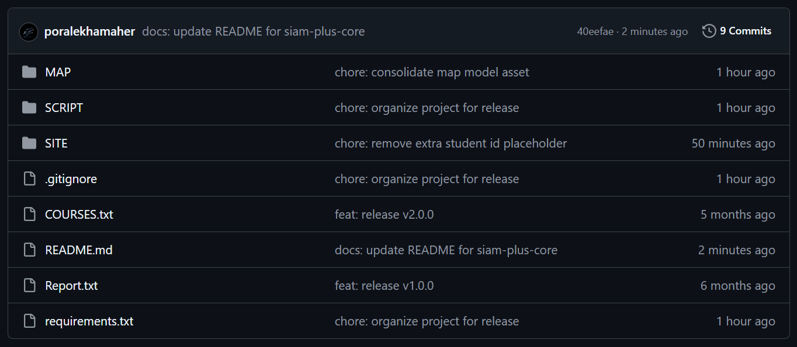

# SIAM+

## Student Academic Dashboard & Attendance Management System

<p align="center">
  
</p>

<p align="center">
  <strong>A web-based academic dashboard and classroom workflow prototype that centralizes student academic information, attendance, classroom communication, teacher tools, and academic planning into one lightweight Flask system.</strong>
</p>


<p align="center">
  
  
  
  
  
  
</p>

<p align="center">
  <a href="#project-demo">Demo</a> •
  <a href="#visual-showcase">Screenshots</a> •
  <a href="#project-capability-summary">Capability</a> •
  <a href="#complete-feature-map">Features</a> •
  <a href="#technical-architecture">Architecture</a> •
  <a href="#engineering-decisions">Engineering Decisions</a> •
  <a href="#future-improvements">Future Work</a>
</p>

---

## Repository Notice

This is the **public showcase repository** for SIAM+.

> The complete source code is maintained in a private repository to protect academic ownership, student-data privacy, SIS integration details, authentication logic, and future development rights.  
> This public repository is designed to present the project professionally through documentation, screenshots, feature breakdowns, architecture explanation, demo materials, and technical reasoning.

Recommended repository split:

```text
siam-plus       → public showcase and documentation repository
siam-plus-core  → private source-code repository
```

---

# Project Demo

<p align="center">
  <a href="https://drive.google.com/file/d/119M32MNyA7R6qQUP1gpqu6AWmuIKk9xR/view?usp=sharing" target="_blank">
    
  </a>
</p>

<p align="center">
  <strong>Watch the 15-minute SIAM+ project showcase</strong>
  <br/>
  The demo presents the student dashboard, teacher dashboard, attendance workflow, live poll system, quick-share feature, notes workflow, GPA and credit progress, copy/save interactions, export/download workflows, and 3D campus map.
</p>

---

# Project Capability Summary

SIAM+ is not only a timetable viewer. It is a full academic workflow prototype that combines student self-service tools and teacher classroom management features.

The system demonstrates capability in:

- Full-stack web application architecture
- Flask backend routing and API design
- Selenium-based SIS data extraction
- JSON-backed prototype data storage
- Dynamic JavaScript dashboard rendering
- Attendance session management
- CSV download/export workflow
- Teacher-to-student quick communication
- Student notes and saved resource workflow
- Live poll creation and response handling
- GPA, credit, and academic progress calculation
- Course planning and grade goal support
- Clipboard/click-to-copy user experience patterns
- 3D campus map prototype integration
- Privacy-aware student information display
- Public/private repository separation for code protection

---

# Visual Showcase

This section presents the major SIAM+ screens and explains what each screen demonstrates.

---

## 1. Student Dashboard Overview

<p align="center">
  
</p>

The student dashboard is the main student-facing interface of SIAM+. It combines academic summary cards, timetable visibility, attendance interaction, quick access tools, and real-time classroom prompts.

This screen demonstrates:

- Student identity and greeting area
- Completed credit summary
- Remaining credit summary
- GPA display with privacy reveal behavior
- Weekly timetable section
- Current academic progress cards
- Teacher poll pop-up displayed inside the student dashboard
- Attendance session awareness
- Quick access buttons for external academic tools
- Responsive dark-themed card layout
- Dashboard-first design instead of page-by-page academic checking

The idea behind this screen is to reduce academic friction. Students should not need to manually move between separate pages to understand their class schedule, academic progress, and classroom activity.

---

## 2. 3D Campus Map, Attendance, and Notes

<p align="center">
  
</p>

This screen shows how SIAM+ supports daily academic use beyond normal timetable viewing.

This screen demonstrates:

- 3D campus map viewer
- Campus/building visualization area
- Attendance check-in panel
- Session code input workflow
- Waiting state when attendance is not active
- Student notes panel
- Saved note cards
- Personal academic reminders
- Student-centered layout for repeated daily usage

The map section is a prototype layer for helping students understand campus or building locations. The attendance panel lets students submit teacher-provided codes during class. The notes panel supports personal academic reminders and saved classroom resources.

---

## 3. Quick Share and Save-to-Notes Workflow

<p align="center">
  
</p>

This screen highlights a key teacher-to-student communication workflow.

This screen demonstrates:

- Teacher-sent quick-share resource
- Temporary resource/message card
- Countdown timer for shared item availability
- “Save to Notes” action
- Student notes integration
- Saved teacher message/resource
- Grade goal planner area
- Semester course planner area
- Student decision support beyond simple data display

The quick-share feature is important because teachers often need to send short links, instructions, class resources, or temporary messages during a lesson. SIAM+ lets students receive the resource and save it into notes so it does not disappear after the temporary classroom window ends.

---

## 4. Teacher Attendance Dashboard

<p align="center">
  
</p>

The teacher dashboard provides the main classroom control interface.

This screen demonstrates:

- Teacher identity area
- Attendance session control
- Active attendance code generation
- Large attendance code display
- Click-to-copy style workflow for fast classroom sharing
- Late attendance toggle
- Live student check-in list
- Attendance status monitoring
- Session archive/history access
- Decision spinner utility
- Random classroom activity support
- Teacher-centered dashboard layout

The teacher can start an attendance session, show or share the generated code, monitor check-ins, enable late mode, stop the session, archive the session, and export the records. This turns attendance from a manual process into a structured classroom workflow.

---

## 5. Teacher Poll and Quick Share Tools

<p align="center">
  
</p>

This screen shows the classroom interaction tools available to teachers.

This screen demonstrates:

- Class location management
- Building and room update workflow
- Quick-share message creation
- Active quick-share status display
- Timed poll creation
- Poll answer option inputs
- Poll duration control
- Poll history section
- Announcement maker section
- Classroom activity/game section
- Teacher workflow grouping in a single interface

Teachers can use these tools to send resources, update room details, run live classroom polls, and create announcements without leaving the dashboard.

---

## 6. Private Core Repository Language Breakdown

<p align="center">
  
</p>

This screenshot shows the approximate language composition of the private source-code repository.

The project uses:

- **Python** for Flask routes, API handling, sessions, JSON file operations, attendance workflows, academic summary logic, and Selenium scraping coordination.
- **HTML** for student and teacher dashboard structure.
- **JavaScript** for dynamic dashboard rendering, timetable display, attendance interaction, live polls, quick-share handling, notes, copy actions, and UI state changes.
- **CSS** for the responsive interface, dark dashboard design, card layouts, buttons, spacing, and visual hierarchy.

This language breakdown shows that SIAM+ is a full-stack prototype, not a single-page mockup.

---

## 7. Private Core Repository Structure

<p align="center">
  
</p>

This screenshot shows the private implementation repository structure.

The private source repository includes important implementation areas such as:

- `SITE/` — main Flask web application and dashboard files
- `SCRIPT/` — scraper or utility scripts
- `MAP/` — map-related assets or campus model files
- `COURSES.txt` — course catalog or degree-plan support data
- `requirements.txt` — Python dependency list
- `README.md` — private developer documentation
- `.gitignore` — sensitive/generated file exclusion rules
- Additional release/support files used for academic submission and demonstration

The public repository does not expose the full source code. It shows the project capability, screenshots, and design reasoning while keeping the implementation protected.

---

# Complete Feature Map

This section documents the full scope of the SIAM+ prototype.

---

## Student-Side Features

| Feature Area | Feature | Description |
|---|---|---|
| Dashboard Home | Student greeting and summary | Gives the student a personalized academic landing page |
| Dashboard Home | Card-based layout | Organizes important academic information into readable sections |
| Timetable | Weekly timetable | Displays weekly class schedule in a student-friendly layout |
| Timetable | Today’s class focus | Helps students quickly identify current-day classes |
| Timetable | Course information display | Shows course codes, names, times, rooms, and related class details |
| Academic Progress | GPA display | Shows GPA information in the dashboard |
| Academic Progress | GPA privacy reveal | Allows GPA to remain hidden until the student intentionally reveals it |
| Academic Progress | Completed credits | Displays credits already completed |
| Academic Progress | Remaining credits | Shows credits still needed for completion |
| Academic Progress | Transfer credits | Handles transferred or credited courses separately |
| Academic Progress | Graded credits | Separates GPA-contributing credits from non-graded credits |
| Academic Progress | Degree progress summary | Shows academic completion progress toward graduation |
| Course Records | Course list | Displays available course records and academic history |
| Course Records | Search/filter behavior | Helps students find courses faster |
| Course Planning | Grade goal planner | Supports planning around target or expected grades |
| Course Planning | Semester course planner | Helps students organize future or current semester courses |
| Attendance | Attendance code input | Allows students to submit teacher-generated codes |
| Attendance | Active session awareness | Shows whether attendance is currently available |
| Attendance | Attendance status | Displays present/late/waiting states depending on session logic |
| Announcements | Announcement feed | Displays teacher or system announcements |
| Notes | Personal notes | Allows students to store academic reminders |
| Notes | Save shared resource to notes | Lets students save quick-share resources sent by teachers |
| Quick Share | Receive teacher quick share | Receives temporary class messages or links |
| Quick Share | Countdown/temporary state | Shows that shared classroom resources can expire |
| Live Polls | Student poll pop-up | Displays active teacher polls to students |
| Live Polls | Poll response | Allows students to answer classroom poll questions |
| Location Updates | Room/building update display | Shows classroom location changes from teacher side |
| 3D Map | Campus map viewer | Displays a prototype 3D map/model for location support |
| UX Micro-Interactions | Click-to-copy support | Supports copying important short information such as codes or summaries |
| UX Micro-Interactions | Save actions | Converts temporary classroom information into persistent student notes |
| UX Micro-Interactions | Visual states | Uses waiting, active, saved, and privacy states to guide the user |
| Interface | Responsive layout | Designed to remain usable across screen sizes |
| Interface | Dark dashboard style | Uses modern dark interface styling for a clean academic dashboard feel |

---

## Teacher-Side Features

| Feature Area | Feature | Description |
|---|---|---|
| Teacher Dashboard | Teacher home panel | Provides a central control page for classroom workflows |
| Attendance | Start attendance session | Creates a live attendance session |
| Attendance | Stop attendance session | Ends an active attendance session |
| Attendance | Attendance code generation | Generates a short code for students to submit |
| Attendance | Large code display | Makes the code easy to show in class |
| Attendance | Click-to-copy code behavior | Helps teachers quickly copy and share the attendance code |
| Attendance | Live check-in list | Shows students who have submitted attendance |
| Attendance | Late mode | Allows check-ins to be marked late after a certain point |
| Attendance | Status monitoring | Helps teachers see present/late/waiting states |
| Attendance | Attendance archive | Stores completed sessions in history |
| Export/Download | CSV attendance export | Allows teachers to download attendance records as CSV |
| Export/Download | Portable records | Makes attendance data usable outside the app |
| Polls | Create live poll | Teachers can create a classroom poll |
| Polls | Add poll options | Teachers can define answer choices |
| Polls | Poll duration | Teachers can control how long the poll stays active |
| Polls | Poll history | Previous poll information can be reviewed |
| Quick Share | Send quick message | Teachers can send short temporary messages |
| Quick Share | Send resource link | Teachers can share links or learning resources |
| Quick Share | Active share status | Shows whether a quick-share item is currently active |
| Announcements | Create announcement | Teachers can publish classroom or academic announcements |
| Location | Class location editor | Teachers can update building/room information |
| Location | Location history/context | Supports class-location change tracking |
| Classroom Tools | Decision spinner | Helps with random selection or classroom decisions |
| Classroom Tools | Random team generator | Supports group/team creation activities |
| Classroom Tools | Classroom game utility | Adds lightweight engagement tools |
| UX Micro-Interactions | Copy summary/details | Supports fast copying of useful generated summaries/details |
| UX Micro-Interactions | Clear visual grouping | Separates attendance, polls, quick shares, announcements, and tools |
| Teacher Operations | Single-page workflow | Reduces the need for separate tools during class |

---

## Download, Export, Copy, and Save Features

SIAM+ includes several practical productivity features that make it more than a static dashboard.

| Action Type | Feature | Purpose |
|---|---|---|
| Download | Attendance CSV export | Lets teachers download attendance records for reporting |
| Download | Archived attendance access | Keeps completed sessions available after class |
| Copy | Copy attendance code | Makes it easier for teachers to share codes quickly |
| Copy | Copy generated summaries/details | Allows useful dashboard summaries or classroom details to be copied quickly |
| Save | Save quick-share to notes | Lets students keep temporary teacher-shared resources |
| Save | Save personal notes | Allows students to preserve reminders and academic planning notes |
| Archive | Stop and archive session | Converts live attendance into stored history |
| Review | Poll history | Keeps previous classroom poll information visible |
| Review | Attendance history | Helps teachers review previous class attendance |

These features matter because real academic workflows are not only about viewing data. Teachers and students often need to copy, save, export, download, and reuse information outside the system.

---

## Backend and Data Features

| Feature Area | Feature | Description |
|---|---|---|
| Backend | Flask server | Handles routing, dashboard serving, and API endpoints |
| Backend | Student routes | Supports student dashboard workflows |
| Backend | Teacher routes | Supports teacher dashboard workflows |
| Authentication | Flask sessions | Maintains lightweight login/session state |
| Authentication | Password hashing | Uses hashed local password handling for prototype users |
| Scraping | Selenium automation | Extracts student timetable, profile, and grade data from SIS pages |
| Scraping | SIS login flow | Automates authenticated data retrieval in the prototype |
| Scraping | Timetable parsing | Converts SIS timetable rows into structured data |
| Scraping | Grade extraction | Extracts grade records and credit values |
| Caching | Schedule JSON cache | Saves extracted academic data to reduce repeated scraping |
| Storage | JSON data layer | Stores structured prototype data in readable files |
| Storage | Attendance JSON files | Stores active and archived attendance sessions |
| Storage | Notes JSON files | Stores student note records |
| Storage | Announcement JSON file | Stores announcement data |
| Storage | Location changes JSON | Stores room/building update data |
| Export | CSV generation | Converts attendance records into downloadable CSV format |
| Data Processing | GPA calculation | Calculates academic summary values from grade rows |
| Data Processing | Credit calculation | Separates completed, remaining, transfer, and graded credits |
| Data Processing | Course catalog support | Uses course-related data to support progress views |
| Reliability | Cached fallback concept | Allows dashboard data to load from existing JSON cache |
| Prototype Transparency | Inspectable data files | Makes the system easier to review during academic evaluation |

---

## Frontend and UX Features

| Feature Area | Feature | Description |
|---|---|---|
| Frontend | Vanilla JavaScript rendering | Dynamically updates dashboard sections from JSON/API data |
| Frontend | Timetable rendering | Builds student timetable interface |
| Frontend | Attendance UI | Handles student check-in and teacher monitoring interfaces |
| Frontend | Poll UI | Displays live polls and poll controls |
| Frontend | Quick-share UI | Handles temporary teacher messages/resources |
| Frontend | Notes UI | Allows student note creation and saved resources |
| Frontend | GPA privacy UI | Prevents accidental exposure of sensitive GPA information |
| Frontend | Copy interactions | Adds practical clipboard-style behavior |
| Frontend | Save interactions | Lets users move temporary information into persistent notes |
| Frontend | Status feedback | Uses visual states such as active, waiting, saved, present, late |
| Frontend | Responsive dashboard | Organizes information into clean card-based sections |
| Frontend | 3D model viewer | Integrates campus map/model display |

---

# Technical Architecture

SIAM+ uses a lightweight client-server architecture.

```text
Student / Teacher Browser
        |
        v
Flask Web Server
        |
        |---- Authentication Routes
        |---- Student Dashboard APIs
        |---- Teacher Dashboard APIs
        |---- Attendance APIs
        |---- Announcement APIs
        |---- Notes APIs
        |---- Poll APIs
        |---- Quick Share APIs
        |---- Location Update APIs
        |---- CSV Export Endpoint
        |
        v
JSON Storage Layer
        |
        |---- users.json
        |---- schedule_<student_id>.json
        |---- data/attendance/
        |---- data/attendance_history/
        |---- data/student_notes/
        |---- data/announcements.json
        |---- data/location_changes.json
        |
        v
Selenium SIS Scraper
        |
        v
University SIS Pages
```

The system separates responsibilities into three main layers:

1. **Data extraction layer**  
   Selenium extracts timetable, grade, and profile information from SIS pages.

2. **Backend/API layer**  
   Flask handles authentication, sessions, dashboard routes, API routes, attendance workflows, notes, announcements, quick shares, polls, and CSV export.

3. **Frontend/dashboard layer**  
   HTML, CSS, and JavaScript render the student and teacher dashboards, manage UI states, and provide interactions such as copying, saving, check-in, poll response, and dashboard updates.

---

# Core Workflows

## Student Login and Dashboard Workflow

```text
Student opens SIAM+
    ↓
Student logs in
    ↓
System checks local account/session data
    ↓
SIS data is loaded from cache or refreshed through Selenium
    ↓
Timetable, grade, profile, and academic summary data are prepared
    ↓
Dashboard renders timetable, GPA, credits, attendance, notes, announcements, polls, quick shares, and map
```

## Teacher Attendance Workflow

```text
Teacher opens teacher dashboard
    ↓
Teacher starts attendance session
    ↓
System generates active attendance code
    ↓
Teacher can copy/show the code
    ↓
Students submit the code from the student dashboard
    ↓
Teacher monitors real-time check-ins
    ↓
Teacher may enable late mode
    ↓
Teacher stops and archives session
    ↓
Teacher can export/download attendance as CSV
```

## Quick Share Workflow

```text
Teacher writes a short message or resource link
    ↓
Teacher sends quick share during class
    ↓
Student receives temporary resource card
    ↓
Student can copy or save the resource
    ↓
Saved resource appears in student notes
```

## Poll Workflow

```text
Teacher creates poll question and answer options
    ↓
Teacher sets poll duration
    ↓
Students receive poll prompt
    ↓
Students submit responses
    ↓
Teacher reviews poll activity/history
```

## Notes Workflow

```text
Student creates personal note
    ↓
Student saves academic reminder or teacher-shared resource
    ↓
Notes remain available inside the student dashboard
    ↓
Student can use notes for study planning and class follow-up
```

---

# Engineering Decisions

## Why Flask?

Flask was selected because it is lightweight, easy to structure for academic prototypes, and suitable for building API routes, serving pages, handling sessions, and integrating Python-based scraping logic.

## Why Selenium?

Selenium was used because the prototype needed to extract data from SIS pages where official API access may not be available. It allowed the system to automate login and collect timetable, profile, and grade data.

## Why JSON Storage?

JSON storage was selected for prototype clarity. It makes data easy to inspect, easy to demonstrate, and simple to debug during academic review.

For production use, the JSON layer should be replaced with a database such as PostgreSQL or MySQL.

## Why Keep Source Code Private?

The full source code is private because the system may include SIS integration details, authentication logic, local data-handling patterns, and academic project ownership concerns. The public repository presents the product and engineering thinking without exposing implementation details that could be copied directly.

---

# Data Storage

| Data Type | Example Location |
|---|---|
| Student schedule cache | `SITE/schedule_<student_id>.json` |
| Local user records | `SITE/users.json` |
| Active attendance sessions | `SITE/data/attendance/` |
| Archived attendance sessions | `SITE/data/attendance_history/` |
| Student notes | `SITE/data/student_notes/` |
| Announcements | `SITE/data/announcements.json` |
| Class-location changes | `SITE/data/location_changes.json` |
| Course catalog | `COURSES.txt` |

---

# Installation and Setup

> The full source code is private. These setup instructions describe how the private `siam-plus-core` project can be run by authorized reviewers or supervisors.

## 1. Clone the Private Repository

```bash
git clone https://github.com/YOUR_USERNAME/siam-plus-core.git
cd siam-plus-core
```

## 2. Create Virtual Environment

```bash
python -m venv venv
```

## 3. Activate Virtual Environment

### Windows

```bash
venv\Scripts\activate
```

### macOS / Linux

```bash
source venv/bin/activate
```

## 4. Install Dependencies

```bash
pip install -r requirements.txt
```

## 5. Run the Flask Application

```bash
cd SITE
python server.py
```

Then open:

```text
http://127.0.0.1:5000
```

---

# Requirements

A typical dependency list may include:

```text
Flask
selenium
webdriver-manager
python-dotenv
Werkzeug
```

Additional dependencies may exist depending on the final private implementation.

---

# Security and Privacy

SIAM+ is an academic prototype and should not be deployed publicly with real student data without further security improvements.

Sensitive files should not be committed to a public repository:

```text
.env
SITE/users.json
SITE/schedule_*.json
SITE/data/attendance/*.json
SITE/data/attendance_history/*.json
SITE/data/student_notes/*.json
real SIS usernames
real SIS passwords
real student IDs
real attendance records
real academic records
```

The public repository intentionally excludes the full source code to protect:

- Academic project ownership
- Student-data privacy
- SIS integration details
- Authentication and local account logic
- Attendance and classroom data-handling logic
- Future development rights

---

# Prototype Limitations

The current version is designed as a functional academic prototype, not a production-ready institutional system.

Main limitations include:

- SIS integration depends on Selenium scraping.
- Scraper behavior may fail if the SIS page layout changes.
- JSON storage is not ideal for high-concurrency multi-user deployment.
- Demo or development credentials must be replaced before real deployment.
- Sensitive student data requires stronger security protection.
- Production deployment requires HTTPS, secure cookies, CSRF protection, audit logs, and strict role-based access control.
- Automated unit and integration testing should be expanded.
- Official university approval would be required for real institutional use.

---

# Future Improvements

Recommended future improvements include:

- Replace Selenium scraping with official SIS API integration.
- Migrate JSON storage to PostgreSQL or MySQL.
- Add full admin, teacher, and student role management.
- Add automated unit tests for GPA, credits, attendance, notes, announcements, and location logic.
- Add API integration tests for student and teacher workflows.
- Add push notifications for announcements and room changes.
- Improve accessibility according to WCAG standards.
- Add production deployment using Gunicorn or another WSGI server.
- Add audit logs for attendance and teacher actions.
- Add database backup and recovery support.
- Extend the 3D campus map with searchable rooms and navigation.
- Add optional RFID or verified location-based attendance after policy and privacy review.
- Add official LMS or Moodle integration if institutional API access is granted.
- Add analytics dashboards for attendance trends, late patterns, and student engagement.
- Add role-specific notification history and downloadable academic summaries.

---

# Academic Context

| Item | Description |
|---|---|
| Project Title | SIAM+: Student Academic Dashboard and Attendance Management System |
| Project Type | Academic Software Engineering Prototype |
| Institution | Siam University |
| Program | Bachelor of Science in Information Technology |
| Main Focus | Student dashboard, SIS data extraction, attendance management, classroom workflow support |
| Development Approach | Lightweight Flask web application with JSON-backed prototype storage |

---

# Public Repository Purpose

This public repository is designed to present the project professionally without exposing the full implementation.

It includes:

- Project overview
- Screenshots
- Demo video link
- Technical explanation
- Detailed feature map
- Architecture summary
- Product reasoning
- Academic context
- Future development plan

It does not include:

- Full source code
- Real student records
- SIS credentials
- Private attendance data
- Authentication implementation details
- Sensitive local JSON files

---

# Author

**Hasan Al Maher Rafi**  
Bachelor of Science in Information Technology  
Siam University

GitHub: [@YOUR_USERNAME](https://github.com/YOUR_USERNAME)  
Email: your-email@example.com  
Portfolio: https://your-portfolio-link.com

---

# Supervisor

**Dr. Parham Porouhan**  
Siam University

---

# Acknowledgement

This project was created to explore how academic information visibility and classroom interaction can be improved through a centralized web-based system. Special thanks to the project supervisor, instructors, and Siam University academic environment for supporting the development and review of this prototype.

---

# License

This public repository is intended for academic demonstration and portfolio presentation.

Suggested access note:

```text
Academic Use Only
Source Code Private
Institutional Review Required
```

---

<p align="center">
  
</p>

<p align="center">
  <strong>SIAM+</strong>
  <br/>
  Student Academic Dashboard and Attendance Management System
</p>
